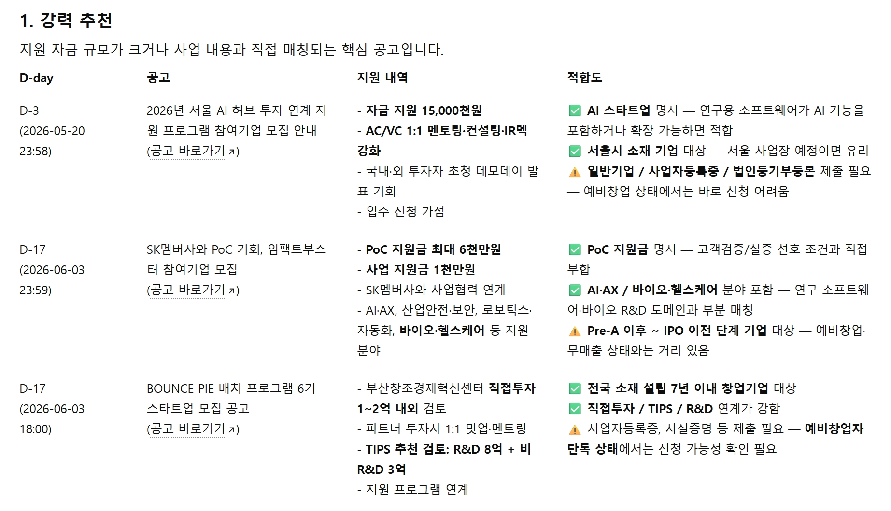
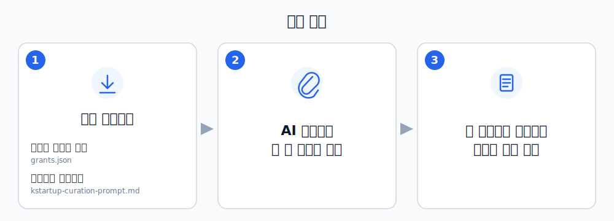

AI에게 파일 두 개만 던지면, K-Startup 창업지원 공고 270여 건 중 **내게 맞는 것만 골라옵니다.**
이 레포는 매일 새벽 자동 갱신되는 최신 공고 데이터(`grants.json`)와 큐레이션 프롬프트(`kstartup-curation-prompt.md`)를 제공합니다.

<table>
  <tr>
    <td align="center"><b>📋 결과 예시</b></td>
  </tr>
  <tr>
    <td>
      
    </td>
  </tr>
</table>

## 사용 방법



### Step 1. 파일 2개 다운로드

아래 두 링크를 각각 클릭하면 GitHub의 파일 페이지가 열립니다.

- **[grants.json 다운로드](./grants.json)** — 매일 새벽 자동 갱신되는 K-Startup 모집중 공고 전체 데이터
- **[kstartup-curation-prompt.md 다운로드](./kstartup-curation-prompt.md)** — AI에게 큐레이션 방법을 알려주는 프롬프트

파일 페이지가 열리면, 우측 상단의 **다운로드 버튼(↓)** 을 눌러 컴퓨터에 저장합니다.


### Step 2. AI 채팅창에 두 파일 첨부

AI 채팅창을 새로 열고, 다운로드한 `grants.json`과 `kstartup-curation-prompt.md`를 **둘 다 첨부**합니다.

### Step 3. 아래 문장을 복사해서 입력

```
첨부한 kstartup-curation-prompt.md의 지시에 따라,
첨부한 grants.json을 기준으로 창업지원사업을 큐레이션해줘.

사용자 프로필:
* 사업자 등록 상태:
* 사업자 형태:
* 사업장 소재지:
* 사업 분야:
* 창업자 경력:
* 연령:
* 기타:
```

### Step 4. 프로필 입력 (예시)

자세하게 적을수록 매칭 품질이 좋아집니다.

```
* 사업자 등록 상태: 미등록 / 2026년 하반기 개인사업자 등록 예정
* 사업자 형태: 예비창업자
* 사업장 소재지: 미정 / 서울 또는 경기권 예정
* 사업 분야: B2B SaaS / 연구용 소프트웨어 / 화합물 데이터 관리·SAR 관리 시스템
* 창업자 경력: 생명과학 석사, 컴퓨터 기반 분자설계 연구 경험, 직접 프로토타입 개발 가능
* 연령: 만 40세
* 기타:
  * 비지분 보조금, 초기 사업화자금 선호
  * PoC·고객검증 지원 중요
  * 투자 유치는 장기 검토
  * 대표자 1인 예비창업
  * 매출 없음
  * 기업부설연구소 없음
  * 특허 없음
```

---

> ℹ️ AI에게 파일 URL을 주고 읽으라고 할 경우, 파일 크기(약 1.7MB / 270여 공고) 때문에 **전체 데이터를 다 읽지 못합니다.** `grants.json`은 위 방법대로 다운로드해서 채팅창에 직접 첨부해 주세요.

---

## 주의사항

- 데이터는 **매일 새벽 2시(KST)** 에 자동 갱신됩니다.
- 첨부한 `grants.json` 전체를 분석하므로 한 번 큐레이션에 AI 사용량이 많이 소비됩니다. 일주일에 1번 정도 실행을 권장합니다.
- AI 모델별로 결과가 다릅니다. ChatGPT, Claude에서 테스트했으며 **Claude Opus 4.7**이 가장 좋은 결과를 보였습니다.
- 중요 내용은 반드시 **공식 공고에서 다시 확인**하세요.

## 활용 예시

한 번 큐레이션을 받은 뒤 같은 채팅창에서 다양한 조건으로 재탐색할 수 있습니다.

- "내 프로필 정보 업데이트 하고 싶어"
- "글로벌 진출 지원 사업 중심으로 나와 매치되는 공고만 다시 찾아줘"
- "내 정보와 관계없이 사업화자금 지원이 큰 순서대로 10개만 출력해줘"

## 라이선스

[CC BY-NC 4.0](https://creativecommons.org/licenses/by-nc/4.0/) — 출처 표시 시 자유롭게 변경·배포할 수 있지만, **상업적 이용은 금지**합니다 (유료 서비스, 유료 제품 등).
