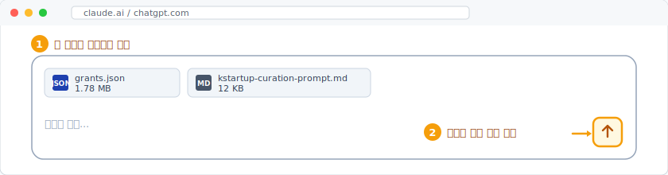

K-Startup 공고 데이터를 매일 자동 수집해서, AI가 본인 사업에 맞는 공고만 추려 등급으로 정리해 주는 흐름을 정리한 레포입니다.

## 사용 방법


### Step 1. 파일 2개 다운로드

<p align="left">
  
</p>

아래 두 링크를 각각 클릭하면 GitHub의 파일 페이지가 열립니다.

- **[grants.json 다운로드](./grants.json)** — 매일 새벽 자동 갱신되는 K-Startup 모집중 공고 전체 데이터
- **[kstartup-curation-prompt.md 다운로드](./kstartup-curation-prompt.md)** — AI에게 큐레이션 방법을 알려주는 프롬프트

파일 페이지가 열리면, 우측 상단의 **다운로드 버튼**(↓)을 클릭해 컴퓨터에 저장합니다.

### Step 2. AI 채팅창에 두 파일 첨부

<p align="left">
  
</p>

AI 채팅창을 새로 열고, 다운로드한 `grants.json`과 `kstartup-curation-prompt.md`를 **둘 다 첨부한 후 실행**합니다.

> ℹ️ **AI 채팅창에 꼭 파일을 첨부해 주세요.** 파일 URL을 제시할 경우 전체 데이터를 다 읽어오지 못하고 일부 데이터로만 분석을 시작합니다.

### Step 3. 아래 문장을 복사해서 입력

본인이 원하는 공고를 찾기 위한 상세 조건을 입력합니다. 본인의 상황과 선호 조건, 피하고 싶은 조건들을 입력합니다. **상세하게 입력할수록** 원하는 공고가 매칭됩니다.

```
첨부한 kstartup-curation-prompt.md의 지시에 따라,
첨부한 grants.json을 기준으로 창업지원사업을 큐레이션해줘.

사용자 프로필:
* 사업자 등록 상태:
* 사업자 형태:
* 사업장 소재지:
* 사업 분야:
* 창업자 경력:
* 연령:
* 선호 조건 및 비선호 조건:
```

**프로필 입력 예시** — 아래는 예시이며, **실제 정보로 교체해서 입력**하세요.

```
* 사업자 등록 상태: 법인사업자 (2025-10-01 설립)
* 사업자 형태: 법인 / 기술기반 스타트업
* 사업장 소재지: 서울 (자체 사무실)
* 사업 분야: B2B SaaS / 결제 정산·검증 자동화 플랫폼
* 창업자 경력: 백엔드 엔지니어 10년 (핀테크 시니어급)
* 연령: 만 35세
* 선호 조건 및 비선호 조건:
  * 투자 유치 단계 (시드~프리A) 진행 중 — 지분형 펀딩 검토 가능
  * PoC·고객검증 지원이 가장 중요 (PoC 자금, 레퍼런스 고객 매칭)
  * 입주 시설 불필요 (자체 사무실 보유)
  * AI 경진대회·해커톤 형식 제외
  * 매출 일부 있음 (B2B 파일럿 진행 중)
  * 직원 3명 (대표 + 백엔드 2)
```

---

**📋 결과 예시**

<p align="left">
  
</p>

---

## 주의사항

- 데이터는 **매일 새벽 2시 (KST)** 자동 갱신됩니다. **새로운 데이터로 검색을 하려면 `grants.json`을 다시 다운로드해 주세요.**
- 첨부한 `grants.json` 전체를 분석하므로 한 번 큐레이션에 AI 사용량이 많이 소비됩니다.
- AI 모델별로 결과가 다릅니다. ChatGPT, Claude에서 테스트했으며 **Claude Opus 4.7**이 가장 좋은 결과를 보였습니다.
- 중요 내용은 반드시 **공식 공고에서 다시 확인**하세요.

## 활용 예시

한 번 큐레이션을 받은 뒤 같은 채팅창에서 다양한 조건으로 재탐색할 수 있습니다.

- "내 프로필 정보 업데이트 하고 싶어"
- "글로벌 진출 지원 사업 중심으로 나와 매치되는 공고만 다시 찾아줘"
- "내 정보와 관계없이 사업화자금 지원이 큰 순서대로 10개만 출력해줘"
- "추천해 준 공고들의 자금 규모와 자격 조건을 한눈에 비교할 수 있게 표로 정리해줘"
- "부적합으로 분류한 공고 중에서도 자격 조건만 살짝 맞으면 가능한 것들 다시 검토해줘"

## 라이선스

[CC BY-NC 4.0](https://creativecommons.org/licenses/by-nc/4.0/) — 출처 표시 시 자유롭게 변경·배포할 수 있지만, **상업적 이용은 금지**합니다 (유료 서비스, 유료 제품 등).
